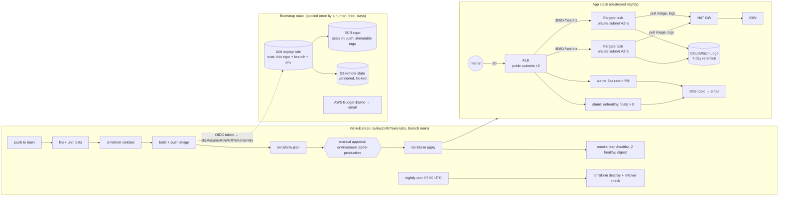

# Lab 06 — ECS Fargate + CI/CD (the flagship)

**What it builds:** the smallest deployment that is shaped like production. A
containerised service runs as **2 Fargate tasks in private subnets** behind a
public **Application Load Balancer**, ships logs to CloudWatch, pages an SNS topic
on 5xx or unhealthy targets, and is deployed by **GitHub Actions through an OIDC
role** — lint → tests → image build + ECR scan → `terraform plan` → **manual
approval** → `terraform apply` → smoke test. A **scheduled workflow destroys it
every night** so nothing is left billing, and an **AWS Budget** emails at $5.



## Layout
```
labs/06-ecs-fargate-cicd/
├── app/                 app.py (stdlib HTTP: /healthz, /version), test_app.py, Dockerfile
├── bootstrap/           ONE-TIME, local: state bucket, ECR, GitHub OIDC provider,
│                        deploy role, $5 budget  (all free, long-lived)
├── versions.tf          app stack: provider + default tags (no backend here)
├── main.tf              data sources + locals (ECR repo is LOOKED UP, not created)
├── network.tf           VPC, 2 public + 2 private subnets, IGW, 1 NAT
├── alb.tf               ALB, target group (/healthz), listeners, security groups
├── iam.tf               task-execution role (hand-scoped) + empty task role
├── ecs.tf               log group, cluster, task definition, service (2 tasks)
├── monitoring.tf        SNS topic, 5xx-rate alarm, unhealthy-host alarm
├── outputs.tf           what exercise.sh + the CI smoke job read
├── backend.tf.example   copy to backend.tf (git-ignored) for remote state
├── exercise.sh          evidence + assertions (same script locally and in CI)
└── docs/iam-bootstrap-policy.json   least-privilege policy for the HUMAN who bootstraps
.github/workflows/lab06.yml          the pipeline
.github/workflows/lab06-destroy.yml  nightly teardown
```

## Concepts demonstrated
- **Private compute behind a public edge.** Tasks have no public IP; the only
  inbound path is ALB SG → task SG on :8080. Egress (image pull, logs) goes out
  through one NAT Gateway.
- **Keyless CI.** GitHub mints a short-lived OIDC token per job; AWS exchanges it
  for role credentials *only if* the token's `aud` and `sub` match the trust
  policy — `repo:ravikus1457/aws-labs:ref:refs/heads/main` for ordinary jobs and
  `repo:ravikus1457/aws-labs:environment:lab06-production` for the approval-gated
  apply job. No secret is stored anywhere.
- **Immutable artefacts.** The image tag is the git SHA; ECR tags are immutable;
  `/version` echoes the tag; the smoke test compares the digest ECR holds for that
  tag against the digest the running tasks report. "What is deployed?" has an
  exact answer.
- **Plan/apply separation with a human gate.** The reviewed `tfplan` (and the
  provider lock file) travel as an artifact; `apply` runs *that* plan, nothing
  else. If the world changed in between (e.g. the nightly destroy ran), Terraform
  refuses the stale plan rather than improvising.
- **Deployment safety.** ECS deployment circuit breaker with rollback +
  `wait_for_steady_state`: a broken image fails the apply step instead of
  flapping in production.
- **Two IAM roles, two jobs.** Execution role = the ECS agent (pull *this* repo,
  write *this* log group — not the broad managed policy). Task role = the app
  (empty, because the app calls no AWS APIs; it exists to show the seam).
- **Alerting that measures the thing.** 5xx *rate* (not count) including ALB-
  generated 5xx so "no healthy targets" is visible; unhealthy-host count; missing
  data treated as OK so an idle or destroyed lab is quiet.
- **Nothing left running.** Scheduled destroy, then a tagging-API check that zero
  resources tagged `stack=app` survive — the verifier reads ground truth, not
  Terraform's opinion.

## Decisions and trade-offs
| Decision | Chosen | Alternatives and why not (here) |
|---|---|---|
| Compute | **Fargate** | **EC2 launch type**: cheaper per vCPU at scale and allows GPUs/daemons, but you own patching, capacity and the ASG — the lab's point is the pipeline, not host ops. **Lambda (+ API GW/ALB)**: cheapest at near-zero traffic and no VPC/NAT needed, but 15-min cap, cold starts, and a different packaging model; pick it for event-driven or spiky HTTP, pick Fargate for a long-running service with a plain container contract. |
| Egress for private tasks | **1 NAT Gateway** | **VPC endpoints** (ECR api + dkr, S3 gateway, CloudWatch Logs) remove the NAT entirely: $0.01/hr per interface endpoint per AZ, ~3 endpoints × 2 AZs ≈ $0.06/hr — *more* than one NAT at this scale, and the tasks then have no internet at all (good for prod, awkward for a lab). **NAT per AZ** doubles cost for AZ-failure egress resilience the lab does not need. **Public subnets + public IPs** (labs 02/04) is cheapest but is the thing hiring managers ask you *not* to do. |
| CI → AWS auth | **OIDC role** | **IAM user access keys in GitHub secrets**: works, but a long-lived credential that can leak, must be rotated, and is not bound to a repo/branch. OIDC credentials live ~1 h and the trust policy is the allow-list. |
| State | **S3 remote, S3-native lock** | Local state cannot be shared between the plan job, the apply job and the nightly destroy. DynamoDB locking is the older pattern; `use_lockfile` (TF ≥ 1.10) needs no table. |
| Image tags | **Immutable, = git SHA** | `latest` is unreproducible; a re-run must *reuse* an existing SHA tag, which the build job does. |
| Approval | **GitHub environment with required reviewers** | Auto-apply on green is fine for dev; a human gate before prod is what most shops expect to see. |
| TLS | **Off by default** (`enable_https = false`) | Needs an ACM cert → needs a domain. Flip the variable + pass `acm_certificate_arn` and :80 becomes a 301 to :443. |
| Container Insights | **Off** | The one ECS feature with a real per-task charge; ALB/service metrics are free. |

## Cost (us-east-1 list prices, approximate — verify on the pricing pages)
| Resource | While up | Note |
|---|---|---|
| NAT Gateway | $0.045/hr + $0.045/GB | The biggest line. Image pull ≈ 50 MB. |
| ALB | $0.0225/hr + LCU (~$0.008/hr idle) | Internet-facing, 2 AZs |
| Public IPv4 (NAT EIP + 2 ALB IPs) | 3 × $0.005/hr | Charged since Feb 2024 |
| Fargate 2 × (0.25 vCPU, 0.5 GB) | 2 × ~$0.0112/hr | Per-second billing |
| CloudWatch Logs | $0.50/GB ingested | A few KB/min here; 7-day retention |
| CloudWatch alarms (2) | $0.10 each / month | Standard-resolution metric alarms |
| SNS email | free | Confirmation link must be clicked |
| ECR | $0.10/GB-month | ~50 MB per image, lifecycle keeps 10 |
| S3 state bucket | ~$0 | KB-sized objects |
| VPC, subnets, IGW, SGs, IAM, OIDC provider, Budget | $0 | |
| **Total app stack** | **≈ $0.11/hr ≈ $2.60/day** | Nightly destroy caps a forgotten stack at one day |

The bootstrap stack costs nothing to leave in place. The $5 budget emails at $4
(80%) and $5 (100%) actual, and at a $5 *forecast*.

## Bootstrap order (the first apply is local; after that CI owns it)
Chicken-and-egg: the workflow needs a role to assume, but the role is defined in
Terraform. So the free, long-lived pieces are a separate stack you apply **once**
with human credentials.

1. **Create the bootstrap IAM user** (root console, once) with *exactly* the
   policy in [`docs/iam-bootstrap-policy.json`](docs/iam-bootstrap-policy.json)
   (everything is resource-scoped to `awslabs-lab06-*`). Create a CLI access key,
   `aws configure` it in **your** terminal — never paste it into a chat. Or reuse
   the `labs-admin` user from [docs/SETUP.md](../../docs/SETUP.md) if you already
   have one.
2. **Apply the bootstrap stack** (local state, ~10 free resources):
   ```bash
   cd labs/06-ecs-fargate-cicd/bootstrap
   terraform init
   terraform apply -var alert_email=you@example.com
   # already have a GitHub OIDC provider in this account? add: -var create_oidc_provider=false
   # want to run plan/apply locally through the SAME role CI uses?  add:
   #   -var 'extra_trusted_principal_arns=["arn:aws:iam::<acct>:user/<your-user>"]'
   ```
   Keep `bootstrap/terraform.tfstate` (git-ignored) somewhere safe.
3. **Wire GitHub** — the stack prints the exact commands:
   ```bash
   terraform output -raw github_cli_commands | bash     # sets 5 repo variables
   # the approval gate: an environment with YOU as required reviewer
   gh api --method PUT repos/ravikus1457/aws-labs/environments/lab06-production \
     --input - <<< "{\"reviewers\":[{\"type\":\"User\",\"id\":$(gh api user -q .id)}]}"
   ```
4. **Push to `main`** touching `labs/06-ecs-fargate-cicd/` (or *Run workflow* in
   the Actions tab). Watch: lint → validate → build+push → plan → **waiting for
   approval** → approve → apply → smoke. The `apply` job's summary links the ALB.
5. **Confirm the SNS email** AWS sends you, or the alarms page nobody.
6. Leave it, or run *lab06-destroy* by hand. The cron destroys it at 07:00 UTC
   regardless and fails loudly if anything tagged `stack=app` survives.

> GitHub disables scheduled workflows after 60 days without repo activity. If
> this repo goes quiet, run `lab06-destroy` by hand before walking away.

### Running it locally instead (no CI)
```bash
# remote state (optional): cd labs/06-ecs-fargate-cicd && (cd bootstrap && terraform output -raw backend_tf) > backend.tf
# build + push an image (needs docker; on an arm64 machine add --platform linux/amd64)
aws ecr get-login-password | docker login --username AWS --password-stdin "$(cd bootstrap && terraform output -raw ecr_repository_url | cut -d/ -f1)"
TAG=$(git rev-parse HEAD)
docker build --platform linux/amd64 --build-arg APP_VERSION=$TAG --build-arg GIT_SHA=$TAG -t "$(cd bootstrap && terraform output -raw ecr_repository_url):$TAG" app/
docker push "$(cd bootstrap && terraform output -raw ecr_repository_url):$TAG"
# then the usual runner (apply → exercise → destroy); with no backend.tf it uses local state
TF_VAR_image_tag=$TAG scripts/run-lab.sh labs/06-ecs-fargate-cicd
TF_VAR_image_tag=$TAG scripts/run-lab.sh labs/06-ecs-fargate-cicd --plan-only
```
`scripts/run-all.sh` skips this lab (marker file `.skip-run-all`) because it
cannot build the image for you.

## What the runner / smoke job verifies (evidence)
`exercise.sh` (identical locally and in CI) **asserts**:
- `GET http://<alb>/healthz` → **200 `{"status":"ok"}`** (retries ~3 min while targets register)
- target group shows **≥ 2 healthy targets** (one per AZ)
- `describe-services`: **runningCount == desiredCount (2)**
- the **image digest** ECR holds for the deployed tag **equals the digest every
  running task reports** — the deployed artefact is the built artefact
- `/version` reports the deployed tag (WARN if not)

Plus captured, not asserted: response headers, service/deployment state, per-task
AZ + digest, ECR scan severity counts. Evidence lands in
`evidence/06-ecs-fargate-cicd-<run>/` locally or as the `lab06-evidence-<run>`
workflow artifact (14 days).

## Teardown
- **Automatic:** `lab06-destroy` runs nightly (07:00 UTC) and on demand (Actions →
  lab06-destroy → *Run workflow*). It destroys the app stack only and fails if the
  tagging API still finds anything tagged `project=awslabs, lab=06-ecs-fargate-cicd, stack=app`.
- **Local:** `cd labs/06-ecs-fargate-cicd && terraform destroy` (with the same
  `backend.tf` CI uses, or local state if you ran it locally).
- **Everything incl. bootstrap** (when you are done with the lab for good):
  `cd bootstrap && terraform destroy` — the bucket and ECR repo are `force_destroy`,
  so this works even with state versions and images inside. The OIDC provider is
  removed too unless `create_oidc_provider=false`.
- **Last resort:** `scripts/guardrails.sh orphans` lists anything tagged
  `project=awslabs` that is still alive.

## Résumé bullet (defensible — make sure you can explain every word)
> Shipped a containerised service to AWS ECS Fargate (private subnets, ALB, hand-
> scoped IAM task roles, CloudWatch alarms → SNS) through a GitHub Actions pipeline
> that authenticates with OIDC instead of access keys — lint, unit tests, image
> build + ECR vulnerability scan, Terraform plan, manual approval gate, apply, and a
> smoke test that proves the running image digest matches the build — with a cost
> budget and a scheduled nightly teardown.

## Be ready to explain
- What `sts:AssumeRoleWithWebIdentity` does, what `aud` and `sub` are in the
  GitHub token, and why the `sub` for the apply job is `environment:…` not `ref:…`.
- Why the tasks are in private subnets and how they still pull an image (NAT), and
  what VPC endpoints would change (no internet path, per-endpoint hourly cost).
- Execution role vs task role — who assumes each, and why the managed
  `AmazonECSTaskExecutionRolePolicy` is broader than needed.
- Why `terraform apply tfplan` instead of `terraform apply -auto-approve` in the
  apply job, and what a "stale plan" error protects you from.
- What the deployment circuit breaker does, and why `wait_for_steady_state` turns
  `terraform apply` into the deployment gate.
- Why the 5xx alarm is a *rate* with metric math, why ALB-generated 5xx is included,
  and why `treat_missing_data = notBreaching` here.
- What ECR tag immutability buys you and how the build job stays idempotent on a
  re-run of the same commit.
- Where the Terraform deploy role is *not* least-privilege (`ec2:*`, `ecs:*`,
  `elasticloadbalancing:*` region-scoped) and what you would do about it in a real
  org (permission boundaries, a per-stack role, SCPs, `aws:ResourceTag` conditions
  where the service supports them).
- The exact hourly cost while the lab is up and which line item dominates.
