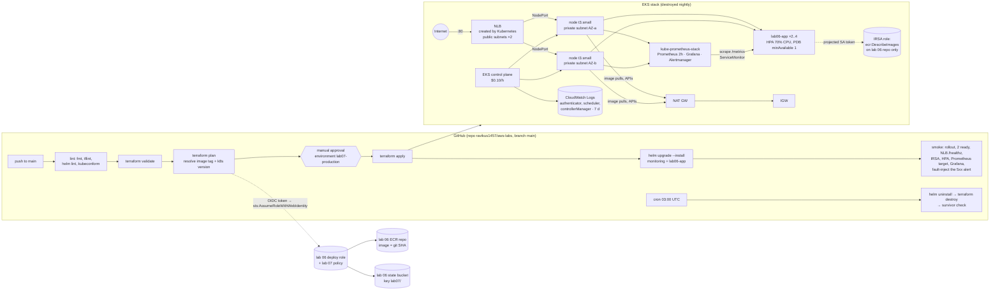

# Lab 07 — EKS + observability (containers at scale, one hour at a time)

**What it builds:** the lab 06 container, this time on **Kubernetes**. Terraform
creates an **Amazon EKS** cluster (one managed node group of 2 × t3.small, IRSA,
control-plane logs, access entries). The pipeline then **Helm-installs** two things:
the app chart (`helm/lab06-app`: 2 replicas, requests/limits, readiness + liveness
probes, PodDisruptionBudget, HPA at 70 % CPU, a Service of type LoadBalancer that
becomes an NLB) and **kube-prometheus-stack** (Prometheus + Grafana + Alertmanager,
sized for two small nodes, 2 h retention, no volumes). The app chart ships a
ServiceMonitor, two **PrometheusRule** alerts (pod restarts, high 5xx ratio) and a
**Grafana dashboard** (requests, latency, restarts, replicas, CPU vs request). The
smoke test proves every layer, including **making the 5xx alert fire** by hitting
the app's `/boom` endpoint. A scheduled workflow tears everything down at 03:00 UTC.

**It is ephemeral and cost-capped on purpose.** An EKS control plane bills $0.10/h
from the moment it exists; with nodes, NAT and NLB the lab is ≈ $0.22/h. It is meant
to live about an hour per run: deploy, look, destroy.



## Layout
```
labs/07-eks-observability/
├── versions.tf          provider + default tags (project, lab, run_id, stack=app)
├── main.tf              data sources, locals, creator-aware admin-principal set
├── network.tf           VPC 10.70/16, 2 public + 2 private subnets, IGW, 1 NAT, LB subnet tags
├── iam.tf               cluster role, node role, cluster OIDC provider, IRSA app role
├── eks.tf               log group, cluster, managed node group, metrics-server add-on, access entries
├── outputs.tf           what exercise.sh, the workflows and this README read
├── variables.tf         every knob, each with the reasoning in its description
├── bootstrap/           ONE-TIME: adds the EKS/IAM/state permissions lab 07 needs to lab 06's deploy role
├── helm/lab06-app/      the chart: Deployment, Service (NLB), HPA, PDB, SA (IRSA), ServiceMonitor,
│   │                    PrometheusRule, Grafana dashboard ConfigMap; values-demo.yaml for the demo
│   └── dashboards/lab06-app.json   the dashboard as a plain file (7 panels)
├── helm/monitoring/values.yaml     kube-prometheus-stack sized for 2 × t3.small, 2 h, no PVs
├── exercise.sh          evidence + assertions (same script locally and in CI)
├── backend.tf.example   copy to backend.tf (git-ignored) for remote state
└── .skip-run-all        run-all.sh skips this lab (CI deploys it)
.github/workflows/lab07.yml          the pipeline
.github/workflows/lab07-destroy.yml  03:00 UTC teardown + survivor check
```

## Concepts demonstrated
- **A cluster, not a service.** ECS ran *our* tasks; EKS runs a Kubernetes control
  plane AWS operates ($0.10/h) plus nodes *we* own. Deployments, Services, HPAs and
  PDBs are Kubernetes objects applied through the API, not AWS resources — which is
  why Terraform stops at the cluster and Helm takes over.
- **IRSA (IAM Roles for Service Accounts).** The cluster is an OIDC issuer; IAM
  trusts it (`aws_iam_openid_connect_provider`). A role's trust policy pins
  `system:serviceaccount:lab06:lab06-app`; the service account carries the
  `eks.amazonaws.com/role-arn` annotation; the EKS pod-identity webhook injects
  `AWS_ROLE_ARN` + a projected token into every pod of that SA. Same mechanism as
  GitHub Actions → AWS in lab 06, with the cluster as the identity provider. The
  smoke test reads the injected env + token file from inside a pod.
- **Access entries, not aws-auth.** `authentication_mode = API`: which IAM
  principals may use kubectl is an AWS API object (the deploy role gets
  `AmazonEKSClusterAdminPolicy`), not a ConfigMap you can lock yourself out of.
- **Requests vs limits, HPA, PDB.** Requests are what the scheduler reserves and
  what the HPA's 70 % is measured against (needs metrics-server, installed as an
  EKS add-on). Limits are enforced: CPU throttles, memory OOM-kills. The PDB says a
  drain may never leave fewer than one ready pod.
- **Prometheus pulls.** The ServiceMonitor tells the operator to scrape every pod
  behind the Service on `/metrics`; the app exposes a hand-rolled counter +
  histogram (added to lab 06's app for this lab; no client library). Targets come
  and go with the pods; the app never knows where Prometheus is.
- **Alerts that measure the thing.** `Lab06AppHigh5xxRate` is a *ratio* of 5xx to
  all requests from the app's own counter; `Lab06AppPodRestarting` is
  kube-state-metrics' restart counter. The smoke test fires 120 × `GET /boom` and
  watches the first one go pending/firing — a detector that has never fired has
  never been tested.
- **Destroy order is part of the design.** Kubernetes created the NLB and
  security-group rules Terraform does not know about. The destroy workflow runs
  `helm uninstall` first, force-deletes any NLB still tagged with the cluster, then
  `terraform destroy`, then counts survivors from the owning services.

## Decisions and trade-offs
| Decision | Chosen | Alternatives and why not (here) |
|---|---|---|
| Orchestrator | **EKS** | **ECS** (lab 06): simpler, no control-plane fee, enough for one service — but the portfolio needs Kubernetes vocabulary (HPA, PDB, Helm, Prometheus operator) that ECS does not exercise. **k3s on the Raspberry Pi**: $0 and tempting, but the Pi is an 8 GB box already running ~75 systemd units at capacity (it has frozen from RAM exhaustion before); a control plane + Prometheus on it is a reliability risk to real workloads, and "ran k3s on a Pi" does not demonstrate IRSA, managed node groups or cloud load balancers. **Kind/minikube on the runner**: free, but nothing AWS-shaped to show. |
| Kubernetes version | **newest in STANDARD support** (default `1.36`, resolved at plan time) | The AWS provider (5.100.0) does not validate the version; EKS does. A version in *extended* support costs $0.60/h instead of $0.10/h, so the plan job asks `describe-cluster-versions` and `upgrade_policy = STANDARD` stops a forgotten cluster from ever drifting into extended pricing. AL2 AMIs stop at 1.32, hence AL2023 nodes. |
| Compute | **1 managed node group, 2 × t3.small, on-demand** | **Fargate profile**: no nodes to manage, but no DaemonSets (node-exporter), 1 pod per micro-VM with a ~1 min cold start, no HPA on CPU without extra work, and a higher per-pod price for an always-on stack. **t4g.small (arm64)** is ~20 % cheaper, but lab 06 builds `linux/amd64` only; a multi-arch build is a lab 06 change. **Spot**: 70 % cheaper but a reclaim mid-smoke-test fails the run (variable `node_capacity_type`). **Auto Mode**: AWS-managed nodes, but a 12 % compute premium and less to explain. |
| App ingress | **Service type LoadBalancer → NLB** (in-tree cloud provider) | **AWS Load Balancer Controller + Ingress/ALB**: path routing, WAF, access logs, TLS at the edge — and another IRSA role, another Helm release, CRDs and ~15 min of debugging surface. For one app with one path the NLB is the honest choice; the controller is the upgrade and the README says so. |
| Monitoring | **kube-prometheus-stack**, 2 h retention, emptyDir | **CloudWatch Container Insights**: no pods to run, but per-metric pricing and nothing to show about Prometheus/Grafana. **Persistent volumes** need the EBS CSI driver (another add-on + IRSA role) and leave volumes to orphan on destroy. **Managed Prometheus / Managed Grafana**: real services, real monthly minimums. |
| Control-plane logs | **authenticator + scheduler + controllerManager** | `api` and `audit` are the volume (audit alone is MB/hour on an idle cluster at $0.50/GB); variable `cluster_log_types` turns them on. The log group is Terraform-owned with 7-day retention so it is destroyed; an EKS-created one never expires. |
| metrics-server | **EKS community add-on** | The metrics-server Helm chart works equally; the add-on is version-matched by EKS and dies with the cluster. |
| Deploy identity | **lab 06's role + an extra inline policy** (`bootstrap/`) | A second role is a second trust policy to audit. The role's trust lists `environment:lab07-production` (lab 06 bootstrap variable `extra_github_environments`). |
| State | **lab 06's bucket, key `lab07/`** | Same bucket, never the same state file; the policy only grants `lab07/*`. |
| Alertmanager → SNS | **Not wired** (documented) | Alertmanager has a native `sns_configs` receiver; it needs an IRSA role with `sns:Publish` on the pod and a topic (lab 06 has one). The lab proves the alert *fires* in Prometheus/Alertmanager; delivery is the five-line follow-up in `helm/monitoring/values.yaml`. |
| Secrets encryption (KMS) | **Off** | EKS ≥ 1.28 encrypts etcd with an AWS-owned key by default; a CMK is $1/month + a key to destroy. |

## Cost (us-east-1 list prices, approximate — verify on the pricing pages)
| Resource | While up | Note |
|---|---|---|
| EKS control plane | **$0.10/h** | Flat, from the second `apply` returns; $0.60/h for versions in extended support (guarded) |
| 2 × t3.small (on-demand) | 2 × $0.0208/h = $0.0416/h | Spot ≈ $0.0125/h for both |
| NAT Gateway | $0.045/h + $0.045/GB | Image pulls ≈ 300 MB (monitoring images from quay.io) |
| NLB | $0.0225/h + NLCU (~$0.006/h idle) | Created by Kubernetes, deleted by `helm uninstall` |
| Public IPv4 (NAT EIP + 2 NLB IPs) | 3 × $0.005/h | Charged since Feb 2024 |
| EBS root volumes 2 × 20 GB gp3 | 2 × $0.0022/h | ~$1.60/month if left running |
| CloudWatch Logs (3 low-volume types) | $0.50/GB | KB/hour; 7-day retention |
| ECR, S3 state, IAM, OIDC provider, VPC | $0 | Shared with lab 06 |
| **Total** | **≈ $0.22/h ≈ $5.30/day** | **Target life: ~1 h per run ≈ $0.25.** The 03:00 UTC destroy caps a forgotten cluster at one day |

Lab 06's account-wide **AWS Budget** ($5/month, 80 %/100 % actual + forecast emails)
covers this lab too; a tag-filtered budget per lab would need cost-allocation tags
activated in the billing console first. A cluster left up for a full month is ~$160 —
that budget email is the backstop, the nightly destroy is the mechanism.

## Bootstrap order (after lab 06's bootstrap; the first apply is CI's)
Lab 07 has no image build and no new role. It needs lab 06's bootstrap (ECR repo
with at least one image, state bucket, OIDC provider, deploy role, budget) plus
three one-time steps:

1. **Let the deploy role's trust accept the lab 07 approval environment** — re-apply
   lab 06's bootstrap (the new default `extra_github_environments = ["lab07-production"]`
   is an in-place trust-policy update, free):
   ```bash
   cd labs/06-ecs-fargate-cicd/bootstrap && terraform apply -var alert_email=you@example.com
   ```
2. **Attach the lab 07 permissions to that role** (EKS, lab 07 IAM roles, the cluster
   OIDC provider, `lab07/*` state objects — all in [`bootstrap/main.tf`](bootstrap/main.tf)):
   ```bash
   cd labs/07-eks-observability/bootstrap
   terraform init
   terraform apply \
     -var deploy_role_arn="$(cd ../../06-ecs-fargate-cicd/bootstrap && terraform output -raw deploy_role_arn)" \
     -var tf_state_bucket="$(cd ../../06-ecs-fargate-cicd/bootstrap && terraform output -raw tfstate_bucket)"
   ```
3. **Create the approval environment** (the stack prints this command too):
   ```bash
   gh api --method PUT repos/ravikus1457/aws-labs/environments/lab07-production \
     --input - <<< "{\"reviewers\":[{\"type\":\"User\",\"id\":$(gh api user -q .id)}]}"
   ```
   The repo variables (`AWS_REGION`, `AWS_DEPLOY_ROLE_ARN`, `TF_STATE_BUCKET`,
   `ECR_REPOSITORY`) are the ones lab 06 set.
4. **Make sure lab 06 has pushed an image with `/metrics`** (any push to `main`
   touching `labs/06-ecs-fargate-cicd/` runs its build-push job before its approval
   gate; the image lands in ECR without the lab 06 stack being applied).
5. **Push to `main`** touching `labs/07-eks-observability/` (or *Run workflow*,
   optionally with an `image_tag` / `kubernetes_version`). Watch: lint → validate →
   plan (resolves the image tag and the newest standard-support version) →
   **waiting for approval** → apply (~15 min: control plane ≈ 10, node group ≈ 5) →
   helm → smoke. The deploy job's summary has the NLB URL and the Grafana command.
6. **Look at it** (≈ an hour is the plan):
   ```bash
   aws eks update-kubeconfig --region us-east-1 --name awslabs-lab07-eks
   kubectl -n lab06 get deploy,pods,svc,hpa,pdb -o wide
   kubectl -n monitoring port-forward svc/monitoring-grafana 3000:80   # http://localhost:3000, user admin
   kubectl -n monitoring get secret monitoring-grafana -o jsonpath='{.data.admin-password}' | base64 -d; echo
   kubectl -n monitoring port-forward svc/monitoring-prometheus 9090:9090   # /targets, /alerts, /rules
   NLB=$(kubectl -n lab06 get svc lab06-app -o jsonpath='{.status.loadBalancer.ingress[0].hostname}')
   for i in $(seq 200); do curl -s -o /dev/null http://$NLB/boom; done     # watch Lab06AppHigh5xxRate fire
   ```
   Your IAM user needs an access entry to run kubectl: pass it in
   `admin_principal_arns` (a `terraform.tfvars` locally, or a workflow re-run after
   adding it to the plan job's `TF_VAR_`s), or run kubectl through the deploy role.
7. **Destroy** — Actions → *lab07-destroy* → *Run workflow*. The cron does it at 03:00
   UTC regardless and fails loudly if anything survives.

> GitHub disables scheduled workflows after 60 days without repo activity. If this
> repo goes quiet, run `lab07-destroy` by hand before walking away.

### Running it locally instead (no CI)
`scripts/run-lab.sh` applies, runs `exercise.sh` (which Helm-installs monitoring and
the app, then verifies), and destroys in its EXIT trap. One gotcha the runner cannot
know about: **the NLB belongs to Kubernetes**, so uninstall the app before the trap
destroys the VPC, or the destroy fails on the NLB's network interfaces.
```bash
# needs: terraform, aws, kubectl, helm, jq, curl; credentials with the bootstrap user's rights
# optional remote state: (cd bootstrap && terraform output -raw backend_tf) > backend.tf
TF_VAR_admin_principal_arns='["arn:aws:iam::<acct>:user/<you>"]' \
  scripts/run-lab.sh labs/07-eks-observability --keep        # apply + exercise, leave it up
# ... look around (KUBECONFIG=evidence/07-eks-observability-<run>/kubeconfig) ...
cd labs/07-eks-observability
helm uninstall lab06-app -n lab06 --wait && helm uninstall monitoring -n monitoring --wait
terraform destroy -auto-approve
scripts/run-lab.sh labs/07-eks-observability --plan-only    # creates nothing
```
`scripts/run-all.sh` skips this lab (marker file `.skip-run-all`).

## What the runner / smoke job verifies (evidence)
`exercise.sh` (identical locally and in CI; CI runs it with `EXERCISE_INSTALL=0`
because the deploy job already ran the Helm installs) **asserts**:
- **≥ 2 nodes Ready** (one per AZ)
- `kubectl rollout status deploy/lab06-app` completes; **≥ 2 ready pods**
- `GET http://<nlb>/healthz` → **200 `{"status":"ok"}`** (retries ~6 min: NLB
  provisioning + DNS); `/version` and `/metrics` captured
- **IRSA injected**: `AWS_ROLE_ARN` inside the pod equals the Terraform role and the
  projected token file exists
- **HPA has a CPU reading** (metrics-server → metrics.k8s.io → HPA)
- **Prometheus scrapes the app**: an active target with `namespace=lab06,
  service=lab06-app` is `up`; **both alert rules are loaded**
- **Grafana `/login` → 200**; the lab 07 dashboard is provisioned (WARN if the
  sidecar is slow); 120 × `GET /boom` then **`Lab06AppHigh5xxRate` pending/firing**
  (WARN if scrape/evaluation timing misses the 5-min window)

Plus captured, not asserted: nodes, pods, Service, HPA, `kubectl top`, Helm
releases, Prometheus targets/rules/alerts JSON, Grafana health, response headers.
Evidence lands in `evidence/07-eks-observability-<run>/` locally or as the
`lab07-evidence-<run>` workflow artifact (14 days; the kubeconfig is excluded).

## Teardown
- **Automatic:** `lab07-destroy` nightly (03:00 UTC) and on demand. Order: `helm
  uninstall` app → monitoring → wait for LoadBalancer Services to finish → force-
  delete any NLB/target group still tagged `kubernetes.io/cluster/awslabs-lab07-eks`
  → `terraform destroy` → count survivors via `eks`, `ec2` (VPC, NAT, EIP, instances),
  `autoscaling`, `elbv2`, `logs`, `iam` (roles `awslabs-lab07-*`, the OIDC provider).
  The tagging index is printed for information only — it lags deletes by >10 min.
- **Local:** uninstall the Helm releases, then `terraform destroy` (same `backend.tf`
  CI uses, or local state).
- **Bootstrap:** `cd bootstrap && terraform destroy` removes the extra policy from
  lab 06's role. Lab 06's own bootstrap is untouched.
- **Last resort:** `scripts/guardrails.sh orphans` lists anything tagged
  `project=awslabs` still alive.

## Résumé bullet (defensible — make sure you can explain every word)
> Provisioned an Amazon EKS cluster with Terraform (managed node group, IRSA via the
> cluster OIDC provider, access-entry authentication, control-plane logs to
> CloudWatch), packaged a containerised service as a Helm chart (probes,
> requests/limits, HPA, PodDisruptionBudget, NLB Service) and instrumented it with
> kube-prometheus-stack — ServiceMonitor, PrometheusRule alerts, a Grafana dashboard
> — all deployed through a GitHub Actions OIDC pipeline with a manual approval gate,
> a smoke test that fault-injects the 5xx alert, and a scheduled nightly teardown
> verified against the owning AWS services.

## Be ready to explain
- **IRSA end to end:** OIDC provider → trust policy `sub` condition → SA annotation →
  pod-identity webhook → `AssumeRoleWithWebIdentity`. Why it beats the node instance
  role (every pod on the node would share it). What EKS Pod Identity changes.
- **Managed node group vs Fargate profile vs self-managed nodes:** who patches the
  AMI, who drains, DaemonSets, per-pod price, cold start.
- **HPA:** what "70 % CPU" is a percentage *of*, where the number comes from
  (metrics-server, not Prometheus), why `replicas` is omitted from the Deployment
  when the HPA owns it, scale-down stabilisation.
- **PDB:** voluntary vs involuntary disruption; `minAvailable: 1` with 2 replicas
  means drains go one pod at a time; it does not protect against a node dying.
- **Requests vs limits:** scheduling vs enforcement; CPU throttling vs OOMKill;
  why Guaranteed/Burstable QoS matters on a 2 GiB node.
- **Why Prometheus pulls:** service discovery (targets appear with pods), the
  scraper decides the interval, no agent config in the app, `up` is a free
  liveness signal per target; where push makes sense (short-lived jobs, Pushgateway).
- **Why a ratio, not a count, for the 5xx alert**, and why the restart alert reads
  kube-state-metrics rather than the app.
- **Service LoadBalancer vs Ingress + AWS Load Balancer Controller:** L4 vs L7, what
  the in-tree cloud provider can and cannot do, why the NLB is not in Terraform state
  and what that means for destroy order.
- **Access entries vs aws-auth**, and what `bootstrap_cluster_creator_admin_permissions`
  does to the principal that ran `terraform apply`.
- **Version policy:** standard vs extended support pricing ($0.10 vs $0.60/h), what
  `upgrade_policy = STANDARD` does, why the plan job resolves the version.
- **Pod capacity on small nodes:** 11 pods per t3.small with secondary-IP mode,
  what prefix delegation changes, and the pod budget of this lab (16–18 of 22).
- **The exact hourly cost while the lab is up and which line item dominates.**
